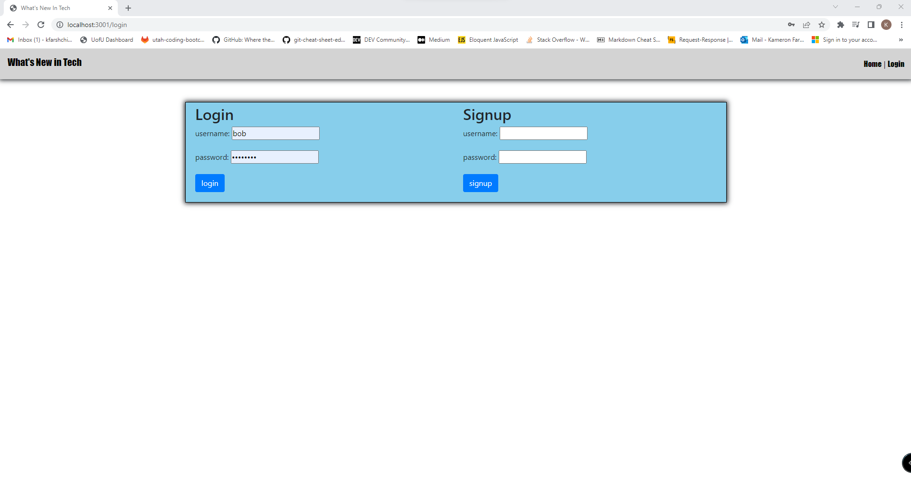

  # What's New In Tech

  ## License
  

  ## Description
  There are many different new technologies being invented every day, and fairly often older technology is getting updated with new features and refactors to make the software run smoother. I decided to build a blog site focused on technology. This website will let users interact with each other’s posts and comment on them. The main page is all the post from all the users to browse and read what is new or what updates have been made. You can read the posts at any time but must be logged in to comment on them. 

  ## Table of Contents
  - [License](#License)
  - [Description](#Description)
  - [Installation](#installation)
  - [Usage](#Usage)
  - [Credits](#credits)
  - [Tests](#Tests)
  - [Questions](#Questions)
  
  ## Installation
  - npm i 
  - npm i mysql
  - npm i mysql2
  - npm i dotenv
  - npm i sequelize
  - npm i express-handlebars
  - npm i bcrypt
  - npm i express
  - npm i express-session
  - npm i connect-session-sequelize 

  ## Usage
  
  
  
  

  The website blog posts can be read by anyone on the home page. However, to comment on someone’s, post you must be logged in. You can login and sign up on the login page. After you are logged in the website will direct you to your profile page when all of your blog posts are listed. Once you are on your profile page you can go to any of your blog posts and read the comments attached to them. The comments will show the user who created them and the date it was submitted. 
  
  The frontend end was developed using handlebars.js, JavaScript, CSS, Bootstrap, and JASS. The back end uses a MySQL server running Sequelize, Express, Dotevn, and Bcrypt.

  
  ## Credits
  - Kameron Farshchian
  - Gustavo Carrillo

  ## Tests
  N/A

  ## Questions
  If you would like to ask me any questions. Contact me at my email address below or you can check out my Github profile.
  - Email-kfarshchian@gmail.com
  - Github user name- kfarshchian
  
  
